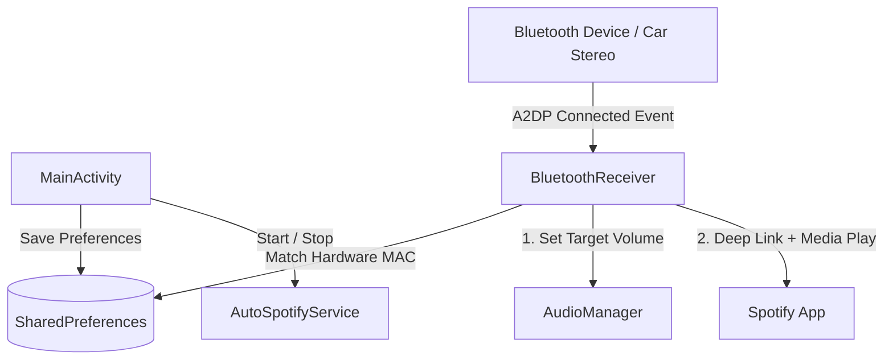

# Connecter 🎧🚗

<p align="center">
  
  
  
  
  
  
</p>

A lightweight, zero-touch Android utility that automatically detects your Bluetooth audio devices—designed primarily for car stereos—sets your preferred volume, and resumes your favorite Spotify playlist immediately upon connection.

---

## 💡 Motivation

Connecter was born out of a simple personal need: every time I got into my car, I had to unlock my phone, open Spotify, pick a playlist, and set the volume manually. 

I wanted a lightweight, set-and-forget tool to handle this automatically whenever my phone connects to the car's Bluetooth, so the music just plays on its own without touching the screen.

---

## 1️⃣ Project Overview

Connecter automates the entire audio handover whenever you connect to a target Bluetooth audio device. 

While fully compatible with any Bluetooth speaker, soundbar, or headphones, it is purpose-built for **car stereos**: running as an ultra-light background service, it listens for your vehicle's Bluetooth A2DP connection, normalizes media volume, and triggers playback on your chosen playlist without ever needing to pull your phone out of your pocket.

---

## 2️⃣ Features

- **Hands-Free Playback:** Automatically opens Spotify and dispatches play commands as soon as your target Bluetooth device connects.
- **Hardware MAC Binding:** Identifies target devices via hardware MAC address—survives device renames in Android Bluetooth settings.
- **A2DP Audio Profile Sync:** Specifically waits for the Bluetooth media audio channel (A2DP) before streaming, preventing audio leakage from phone speakers.
- **Volume Normalization:** Applies your preset volume upon connection; mutes and pauses when disconnected.
- **Curated & Custom Playlists:** Select from preset playlists (*Liked Songs*, *Discover Weekly*, etc.) or paste any Spotify playlist URL.
- **Minimal Battery Footprint:** Ultra-light Foreground Service with dedicated Start/Stop toggles.
- **Material 3 UI:** Clean, responsive design styled with a custom terracotta, cream, and sage green palette.

---

## 3️⃣ Tech Stack

| Technology | Role |
|---|---|
| **Kotlin** | Core application logic and Android KTX extensions. |
| **Android SDK (API 24–36)** | Modern lifecycle and runtime permissions (`BLUETOOTH_CONNECT`, `POST_NOTIFICATIONS`). |
| **Foreground Service** | Keeps receiver active and enables launching Spotify activities from background on Android 10+. |
| **BroadcastReceiver (`BluetoothA2dp`)** | Listens for system-wide Bluetooth media audio state changes. |
| **AudioManager & Media Buttons** | Sets `STREAM_MUSIC` volume and dispatches targeted `KEYCODE_MEDIA_PLAY`/`PAUSE` intents. |
| **Material Components 3** | Responsive card-based layout with adaptive insets. |
| **SharedPreferences** | Fast, lightweight local storage for device MAC, target volume, and playlist URIs. |

---

## 4️⃣ Architecture 🔥



---

## 5️⃣ Project Structure

```text
Connecter/
├── app/src/main/
│   ├── java/it/elia/connecter/
│   │   ├── MainActivity.kt         # UI, permissions, playlist dialog, settings binding
│   │   ├── AutoSpotifyService.kt   # Foreground service managing lifecycle & receiver registration
│   │   └── BluetoothReceiver.kt    # Intercepts A2DP events, sets volume, launches Spotify
│   ├── res/
│   │   ├── layout/activity_main.xml # Material 3 responsive card layout
│   │   ├── values/                  # Colors (terracotta palette), themes, strings
│   │   └── mipmap-anydpi-v26/       # Custom adaptive app icons
│   └── AndroidManifest.xml          # Permissions & service declarations
└── build.gradle.kts                 # Dependencies, SDK targets (API 36), Java 11
```

---

## 6️⃣ Installation & Setup

### Download (Recommended)
1. Download the latest `app-release.apk` from the [Releases](https://github.com/your-username/connecter/releases) page.
2. Open the downloaded APK on your Android device (allow *Install Unknown Apps* if prompted).
3. Ensure the official **Spotify** app is installed and logged in.

> **Developer Build:** Alternatively, clone the repository and run `./gradlew installDebug`.

---

## 7️⃣ Usage

1. **Pair:** Pair your Bluetooth device (car stereo, speaker, etc.) in Android Bluetooth settings.
2. **Grant Permissions:** Open Connecter and accept Bluetooth and Notification permissions.
3. **Configure:**
   - Select your target Bluetooth device from the dropdown.
   - Adjust the target volume slider.
   - Choose a playlist (or tap `+ Incolla link Spotify` to paste any custom playlist URL).
4. **Activate:** Tap **Attiva** (a persistent low-priority status notification will appear).
5. **Connect & Play:** Connect to your Bluetooth device or start your car ignition—music will automatically play through your connected audio system. Tap **Disattiva** anytime to stop.

---

## 8️⃣ Screenshots / Demo

<p align="center">
  
</p>

---

## 9️⃣ API & Integration Points

Connecter runs 100% offline with zero external network requests:
- **Spotify Deep Link:** `Intent.ACTION_VIEW` targeting `com.spotify.music` with `spotify:playlist:<id>` or `spotify:collection:tracks`.
- **Media Button Broadcast:** `Intent.ACTION_MEDIA_BUTTON` (`KEYCODE_MEDIA_PLAY` / `PAUSE`) directed exclusively to `com.spotify.music`.
- **System Events:** `BluetoothA2dp.ACTION_CONNECTION_STATE_CHANGED` (connect) and `ACTION_ACL_DISCONNECTED` (disconnect).

---

## 🔟 Engineering Decisions

- **A2DP over ACL:** Listening to `BluetoothA2dp` ensures the media audio channel is fully routed before triggering playback, preventing audio from playing through the phone's speaker.
- **Volume Handshake Delay:** A short 1.5s delay before volume assignment avoids conflicts with Android's Bluetooth absolute volume negotiation and prevents audio clipping.
- **Hardware MAC Address Matching:** Matches `device.address` instead of `device.name`, ensuring automation doesn't break if you rename your Bluetooth device.
- **Intents over Spotify SDK:** Direct intent dispatch avoids OAuth tokens, developer API keys, token renewals, and network dependencies.
- **Foreground Service:** Required by Android 10+ policies to allow background activity starts (`startActivity`) when Bluetooth connects.

---

## 1️⃣1️⃣ Limitations & Future Improvements

- **Limitations:** Requires the official Spotify client to be installed and signed in.
- **Roadmap:**
  - [ ] Multi-app support (YouTube Music, Apple Music, Audible).
  - [ ] Multi-device profiles with distinct volume and playlist configurations (e.g., car vs. home speaker).
  - [ ] Auto-start service on device reboot (`RECEIVE_BOOT_COMPLETED`).
